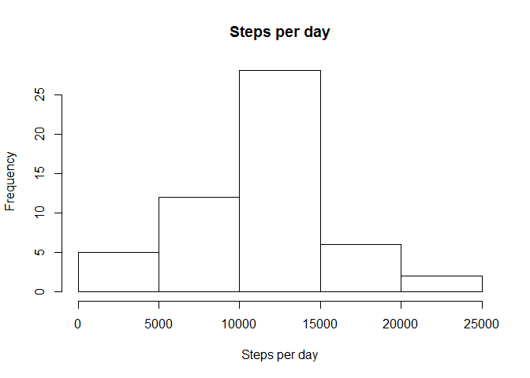
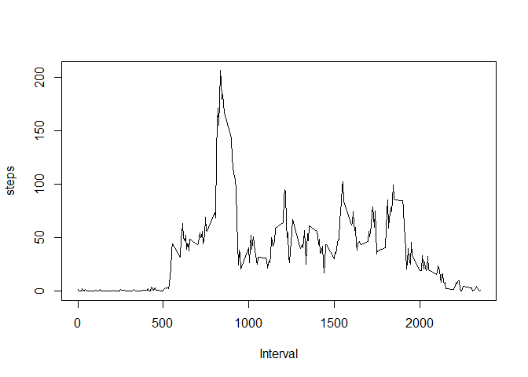

February 14, 2016  

Introduction

It is now possible to collect a large amount of data about personal movement using activity monitoring devices such as a Fitbit, Nike Fuelband, or Jawbone Up. These type of devices are part of the "quantified self" movement -- a group of enthusiasts who take measurements about themselves regularly to improve their health, to find patterns in their behavior, or because they are tech geeks. But these data remain under-utilized both because the raw data are hard to obtain and there is a lack of statistical methods and software for processing and interpreting the data.

This assignment makes use of data from a personal activity monitoring device. This device collects data at 5 minute intervals through out the day. The data consists of two months of data from an anonymous individual collected during the months of October and November, 2012 and include the number of steps taken in 5 minute intervals each day.

Read activity.csv file


```r
data <- read.csv("activity.csv")
```

Calculate mean steps per day and plot the same


```r
steps_per_day <- aggregate(steps ~ date, data, sum)
```


```r
hist(steps_per_day$steps, main = paste("Steps per day"), xlab = "Steps per day")
```



Calculate and display mean and median steps by day


```r
rmean <- mean(steps_per_day$steps)
rmedian <- median(steps_per_day$steps)
```


```r
print(paste0("Mean of steps per day : ", rmean))
```

```
## [1] "Mean of steps per day : 10766.1886792453"
```

```r
print(paste0("Median of steps per day : ", rmedian))
```

```
## [1] "Median of steps per day : 10765"
```

---
What is the average daily activity pattern 


```r
pattern <- aggregate(steps ~ interval, data, mean)
```

Plot of steps per interval


```r
plot(pattern$interval, pattern$steps, type = "l", xlab = "Interval", ylab="steps")
```




```r
max_interval <- pattern[which.max(pattern$steps), 1]
```


```r
print(paste0("The 5 minute interval for which the mean of steps is highest is : ", max_interval))
```

```
## [1] "The 5 minute interval for which the mean of steps is highest is : 835"
```

---
Imputing missing values


```r
incompleteCases <- sum(is.na(data$steps))
```


```r
print(paste0("Number of missing values : ", incompleteCases))
```

```
## [1] "Number of missing values : 2304"
```

Missing values have been replaced by the mean value for the day


```r
imputedData <- transform(data, steps=ifelse(is.na(data$steps), pattern$steps[match(data$interval, pattern$interval)], data$steps))
```

Zeroes have been imputed for 10-01-2012 as it was the first day and would have been over 9,000 steps higher than the following day, which had only 126 steps. NAs then were assumed to be zeros to fit the rising trend of the data.


```r
imputedData[as.character(imputedData$date) == "2012-10-01", 1] <- 0
```

Plot histogram of steps by day vs date for imputed and non-imputed data


```r
steps_by_day_i <- aggregate(steps ~ date, imputedData, sum)
hist(steps_by_day_i$steps, main=paste("Total steps per interval"), col="blue", xlab="Number of steps")
hist(steps_per_day$steps, main=paste("Total steps per interval"), col="red", xlab="Number of steps", add=T)
legend("topright", c("Imputed", "Non-Imputed"), col=c("blue", "red"), lwd=10)
```


Calculate mean and median for imputed data


```r
rmean.i <- mean(steps_by_day_i$steps)
rmedian.i <- median(steps_by_day_i$steps)
```

Calculate mean/median difference between imputed and non-imputed data


```r
meandiff <- rmean.i - rmean
mediandiff <- rmedian.i - rmedian
```

Calculate total difference


```r
total_diff <- sum(steps_by_day_i$steps) - sum(steps_per_day$steps)
```


```r
print(paste0("Imputed mean is : ", rmean.i))
```

```
## [1] "Imputed mean is : 10589.6937828642"
```

```r
print(paste0("Imputed median is : ", rmedian.i))
```

```
## [1] "Imputed median is : 10766.1886792453"
```

```r
print(paste0("Mean difference between imputed and non-imputed data : ", meandiff))
```

```
## [1] "Mean difference between imputed and non-imputed data : -176.494896381069"
```

```r
print(paste0("Median difference between imputed and non-imputed data : ", mediandiff))
```

```
## [1] "Median difference between imputed and non-imputed data : 1.1886792452824"
```

---
Are there differences in activity patterns between weekdays and weekends?


```r
weekdays <- c("Monday", "Tuesday", "Wednesday", "Thursday", 
              "Friday")
imputedData$dow = as.factor(ifelse(is.element(weekdays(as.Date(imputedData$date)),weekdays), "Weekday", "Weekend"))
steps_by_interval_i <- aggregate(steps ~ interval + dow, imputedData, mean)
library(lattice)
```

```
## Warning: package 'lattice' was built under R version 3.2.3
```

```r
xyplot(steps_by_interval_i$steps ~ steps_by_interval_i$interval|steps_by_interval_i$dow, main="Average Steps per Day by Interval",xlab="Interval", ylab="Steps",layout=c(1,2), type="l")
```


