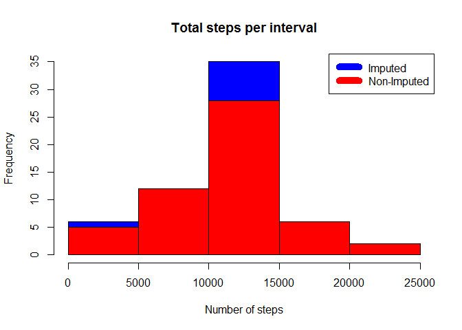

# project1.rmd
Srinivas Ksheerasagara  
February 14, 2016  

Read activity.csv file


```r
data <- read.csv("activity.csv")
```

Calculate mean steps per day and plot the same


```r
steps_per_day <- aggregate(steps ~ date, data, sum)
```


Calculate and display mean and median steps by day


```r
rmean <- mean(steps_per_day$steps)
rmedian <- median(steps_per_day$steps)
```


```
## [1] "Mean of steps per day : 10766.1886792453"
```

```
## [1] "Median of steps per day : 10765"
```

---
What is the average daily activity pattern 


```r
pattern <- aggregate(steps ~ interval, data, mean)
```

Plot of steps per interval


```r
max_interval <- pattern[which.max(pattern$steps), 1]
```


```
## [1] "The 5 minute interval for which the mean of steps is highest is : 835"
```

---
Imputing missing values


```r
incompleteCases <- sum(is.na(data$steps))
```


```
## [1] "Number of missing values : 2304"
```

Missing values have been replaced by the mean value for the day


```r
imputedData <- transform(data, steps=ifelse(is.na(data$steps), pattern$steps[match(data$interval, pattern$interval)], data$steps))
```

Zeroes have been imputed for 10-01-2012 as it was the first day and would have been over 9,000 steps higher than the following day, which had only 126 steps. NAs then were assumed to be zeros to fit the rising trend of the data.


```r
imputedData[as.character(imputedData$date) == "2012-10-01", 1] <- 0
```

Plot histogram of steps by day vs date for imputed and non-imputed data


```r
steps_by_day_i <- aggregate(steps ~ date, imputedData, sum)
hist(steps_by_day_i$steps, main=paste("Total steps per interval"), col="blue", xlab="Number of steps")
hist(steps_per_day$steps, main=paste("Total steps per interval"), col="red", xlab="Number of steps", add=T)
legend("topright", c("Imputed", "Non-Imputed"), col=c("blue", "red"), lwd=10)
```



Calculate mean and median for imputed data


```r
rmean.i <- mean(steps_by_day_i$steps)
rmedian.i <- median(steps_by_day_i$steps)
```

Calculate mean/median difference between imputed and non-imputed data


```r
meandiff <- rmean.i - rmean
mediandiff <- rmedian.i - rmedian
```

Calculate total difference


```r
total_diff <- sum(steps_by_day_i$steps) - sum(steps_per_day$steps)
```


```
## [1] "Imputed mean is : 10589.6937828642"
```

```
## [1] "Imputed median is : 10766.1886792453"
```

```
## [1] "Mean difference between imputed and non-imputed data : -176.494896381069"
```

```
## [1] "Median difference between imputed and non-imputed data : 1.1886792452824"
```

---
Are there differences in activity patterns between weekdays and weekends?


```r
weekdays <- c("Monday", "Tuesday", "Wednesday", "Thursday", 
              "Friday")
imputedData$dow = as.factor(ifelse(is.element(weekdays(as.Date(imputedData$date)),weekdays), "Weekday", "Weekend"))
steps_by_interval_i <- aggregate(steps ~ interval + dow, imputedData, mean)
library(lattice)
```

```
## Warning: package 'lattice' was built under R version 3.2.3
```

```r
xyplot(steps_by_interval_i$steps ~ steps_by_interval_i$interval|steps_by_interval_i$dow, main="Average Steps per Day by Interval",xlab="Interval", ylab="Steps",layout=c(1,2), type="l")
```


